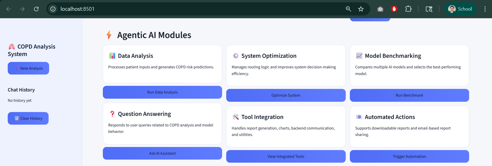
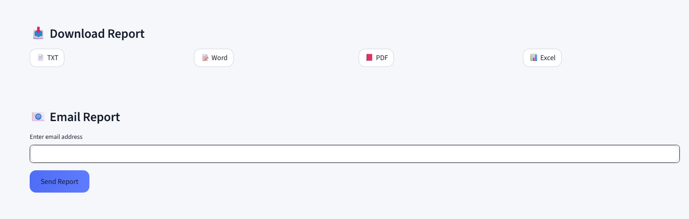
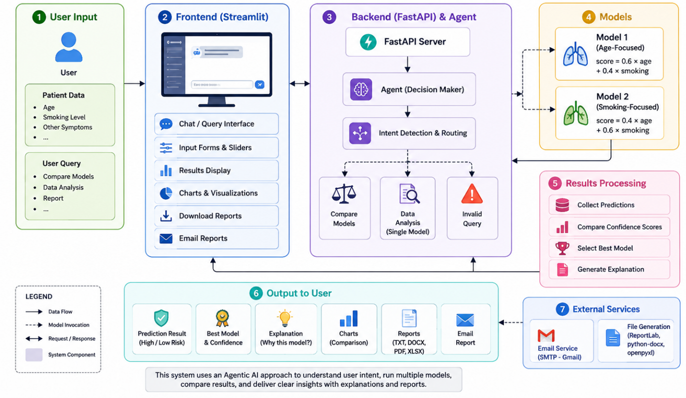
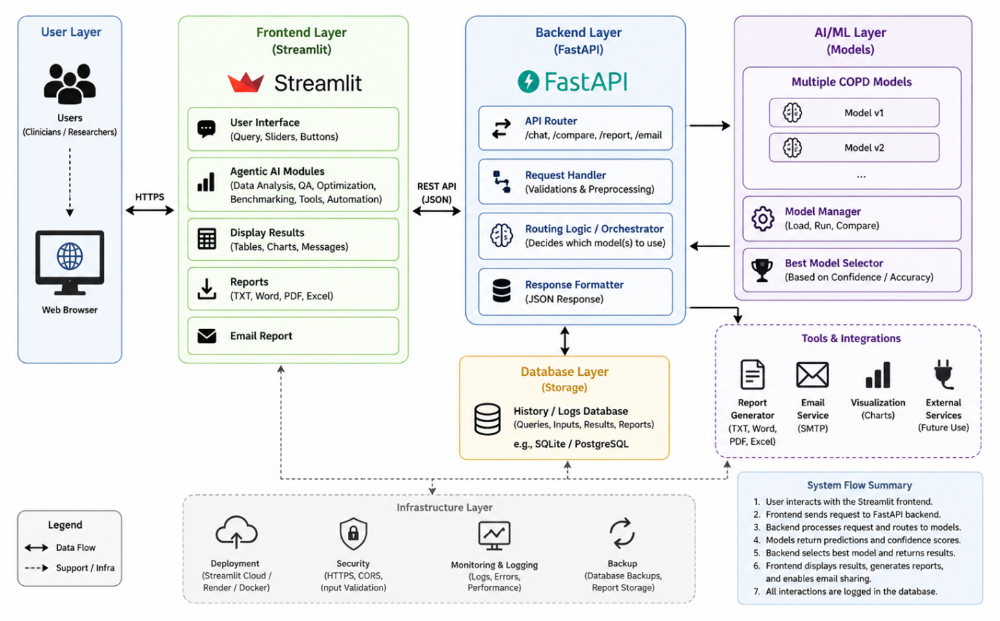

# COPD Multi-Model Analysis System using Agentic AI

An intelligent AI-powered healthcare analysis system developed using FastAPI and Streamlit to analyze COPD (Chronic Obstructive Pulmonary Disease) risk using multiple AI models and an Agentic AI workflow.

---

# Project Overview

This project demonstrates how an Agentic AI system can:
- Analyze patient data
- Compare multiple AI models
- Select the best-performing model
- Generate structured outputs
- Provide intelligent recommendations
- Improve user interaction through a modern interface

The system uses proxy AI models to simulate COPD risk analysis based on:
- Age
- Smoking level

The project combines:
- AI logic
- Backend APIs
- Interactive frontend
- Reporting tools
- Visualization
- Agentic workflow design

---

# Features

- Multi-model COPD risk analysis
- Agentic AI workflow
- Interactive Streamlit frontend
- FastAPI backend
- Model benchmarking
- Session history
- Smart query handling
- Data visualization
- PDF/DOCX report generation
- Excel export
- Email reporting
- Agentic AI modules
- Modern healthcare dashboard UI

---

# Agentic AI Modules

| Module | Description |
|---|---|
| Data Analysis | Processes patient data and generates COPD risk predictions |
| Question Answering | Responds to user queries and guides system usage |
| System Optimization | Controls workflow and improves decision-making |
| Tool Integration | Handles reports, charts, exports, and utilities |
| Model Benchmarking | Compares multiple AI models |
| Automated Actions | Supports report generation and email sharing |

---

# Technologies Used

| Component | Technology / Tool |
|---|---|
| Backend | FastAPI |
| Frontend | Streamlit |
| Programming Language | Python |
| Data Handling | Pandas |
| Data Visualization | Streamlit Charts |
| Reporting | ReportLab, python-docx |
| Excel Export | openpyxl |
| API Communication | Requests Library |
| Email Service | SMTP (Gmail) |
| Development Tool | Visual Studio Code (VS Code) |
| Version Control | Git and GitHub |

---

# System Workflow

1. User enters:
   - Age
   - Smoking level
   - Query type

2. Agentic AI system analyzes user intent

3. System routes request:
   - Compare models
   - Data analysis
   - Guidance

4. AI models process data

5. System generates:
   - Predictions
   - Comparisons
   - Charts
   - Reports

6. Results displayed on UI

---

# Screenshots

## Homepage


---

## Model Comparison


---

## Agentic AI Modules



---

## Reports



---

# System Architecture



---

# Agentic AI Workflow



---

# Installation Guide

## Clone Repository

```bash
git clone https://github.com/mbabar1100/MAI-AGENTIC-SYSTEM.git
```

---

## Install Required Libraries

```bash
pip install -r requirements.txt
```

---

# Run Backend Server

```bash
uvicorn app.main:app --reload
```

Backend URL:

```text
http://127.0.0.1:8000
```

---

# Run Frontend

```bash
streamlit run ui/app.py
```

Frontend URL:

```text
http://localhost:8501
```

---

# Project Structure

```text
MAI-AGENTIC-SYSTEM/
│
├── app/
│   ├── __init__.py
│   ├── agent.py
│   ├── main.py
│   ├── tools.py
│
├── ui/
│   ├── app.py
│
├── screenshots/
│
├── diagrams/
│
├── presentation/
│
├── report/
│
├── requirements.txt
├── README.md
├── .gitignore
```

---

# Results

The system successfully:
- Analyzes patient data
- Compares multiple models
- Selects best-performing model
- Generates reports
- Displays visual outputs
- Supports intelligent workflow routing

---

# Limitations

- Uses proxy AI models
- No real medical dataset
- No deep learning integration yet
- Icons/modules are simulated
- Limited healthcare validation

---

# Future Improvements

Future enhancements may include:
- Real machine learning models using Scikit-learn
- Deep learning integration
- Cloud deployment
- Voice input support
- Real-time healthcare APIs
- File upload support
- Authentication system
- Database integration
- Real patient datasets

---

# References

1. Srinivasu, P. N., et al. “Exploring Agentic AI in Healthcare: A Study on Its Working and Applications.” Frontiers in Medicine, 2025.  
https://www.frontiersin.org/journals/medicine/articles/10.3389/fmed.2025.1753443/full

2. Zhao, L., et al. “AI Agent in Healthcare: Applications, Evaluations, and Future Directions.” Nature Digital Medicine, 2026.  
https://www.nature.com/articles/s44387-026-00076-4

3. Karunanayake, N., et al. “Next-Generation Agentic AI for Transforming Healthcare.” Computational and Structural Biotechnology Journal, 2025.  
https://www.sciencedirect.com/science/article/pii/S2949953425000141

4. Demrozi, F., et al. “Multimodal AI (MMAI) for Next-Generation Healthcare.” Smart Health Journal, 2025.  
https://www.sciencedirect.com/science/article/pii/S2468451125000571

5. Zhang, R., et al. “Multimodal Artificial Intelligence in Medicine: A Task-Oriented Review.” Frontiers in Medicine, 2025.  
https://www.frontiersin.org/journals/medicine/articles/10.3389/fmed.2025.1736272/full

6. FastAPI Documentation  
https://fastapi.tiangolo.com

7. Streamlit Documentation  
https://docs.streamlit.io

8. Python Official Documentation  
https://docs.python.org/3

9. Pandas Documentation  
https://pandas.pydata.org/docs

10. OpenAI Platform Documentation  
https://platform.openai.com/docs

---

# Authors

- Muhammad Babar
- Team Members

---

# License

This project is developed for educational and research purposes.

CU Denver